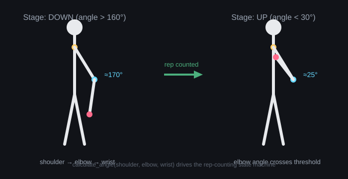

# AI Gym Trainer



A webcam-based app that watches a workout, automatically detects which
exercise is being performed, counts reps, checks form, and generates a
report at the end of the session.

## How it works (high level)

```
Webcam → MediaPipe Pose → Joint Angles → Exercise Classifier → Active Exercise
                                                                       │
                                              Rep Counting + Form Check
                                                                       │
                                                          Workout Report
```

## Project structure

```
ai_gym_trainer/
├── core/
│   ├── pose_estimator.py    # Wraps MediaPipe: camera frame -> landmarks
│   ├── angles.py             # calculate_angle() and landmark helpers
│   ├── exercise_base.py      # Shared template every exercise follows
│   ├── classifier.py         # Feature extraction + exercise auto-detection
│   └── report.py             # Builds the end-of-workout summary
├── exercises/
│   ├── bicep_curl.py         # ✅ Fully implemented
│   ├── squat.py              # ⬜ Stub — not implemented yet
│   ├── shoulder_press.py     # ⬜ Stub — not implemented yet
│   ├── lateral_raise.py      # ⬜ Stub — not implemented yet
│   └── __init__.py           # EXERCISES registry (label -> class)
├── data/
│   ├── raw/                  # CSVs saved by collect_data.py
│   └── processed/            # (reserved for cleaned/merged datasets)
├── models/                   # Trained classifier saved here (.pkl)
├── collect_data.py           # Records labeled training data from your webcam
├── train_model.py            # Trains the exercise classifier
├── main.py                   # Console workout loop (no GUI)
├── app.py                    # Tkinter GUI version
└── requirements.txt
```

## Current status

Only **bicep curl** is fully built: it counts reps for both arms and flags
a rep as incorrect if the elbow drifts sideways too much during the curl.
The other three exercises are empty stubs so the rest of the pipeline
(classifier, report, GUI) has something to reference without crashing.

No model has been trained yet, so `main.py` is currently hardcoded to run
bicep curl directly, skipping auto-detection:

```python
run_workout(use_classifier=False, forced_exercise="bicep_curl")
```

Once you've collected data and trained a model (see below), change that
last line back to `run_workout()` to enable auto-detection.

## Setup

### 1. Install dependencies

```
pip install -r requirements.txt
```

### 2. Run the bicep curl test (no training needed yet)

```
python main.py
```

A window opens showing your webcam feed with a live rep counter,
correct/incorrect count, and feedback text. Do some real curls, then some
intentionally sloppy ones (swing your elbow out) to see the form-check
kick in. Press **q** with the window focused to quit — it saves
`workout_report.json` in the project folder.

## Building auto-detection (once bicep curl is confirmed working)

1. **Collect labeled data** — run once per label, doing that exercise (or
   standing idle) in front of the camera:
   ```
   python collect_data.py --label bicep_curl
   python collect_data.py --label idle
   ```
   Press `r` to start/stop recording samples, `q` to save and quit.

2. **Train the classifier:**
   ```
   python train_model.py
   ```
   This saves `models/exercise_classifier.pkl`.

3. **Switch `main.py` back to auto-detect mode** — edit the last line of
   `main.py`:
   ```python
   if __name__ == "__main__":
       run_workout()
   ```

4. Run `python main.py` again — it will now guess the exercise instead of
   assuming bicep curl.

## Running the GUI

```
python app.py
```

Opens a Tkinter window with Start Workout / Finish Workout buttons, a live
camera feed, and a report panel shown after you finish. Run this from a
terminal, not from inside Jupyter — Tkinter's event loop doesn't play well
with notebooks.

## Using Jupyter instead of the terminal

The `core/` and `exercises/` modules import normally from a notebook as
long as the notebook lives in the project root. Example:

```python
from main import run_workout
report = run_workout(use_classifier=False, forced_exercise="bicep_curl")
```

If you ever need to stop a camera cell early, use the notebook's interrupt
(stop) button rather than closing the window — `main.py` and
`collect_data.py` both use `try/finally` so the camera releases cleanly
either way. If a camera ever seems stuck/locked afterward, restart the
kernel rather than repeatedly re-running the cell.

## Adding a new exercise

Once bicep curl is solid, use it as the template for the next exercise:

1. Open the relevant stub in `exercises/` (e.g. `squat.py`) and implement
   `update()` following the pattern in `bicep_curl.py` — compute the
   relevant joint angle(s), run an up/down state machine on angle
   thresholds, and add a form check.
2. Collect labeled data for it: `python collect_data.py --label squat`
3. Retrain: `python train_model.py`
4. Test it standalone first: `run_workout(use_classifier=False, forced_exercise="squat")`
