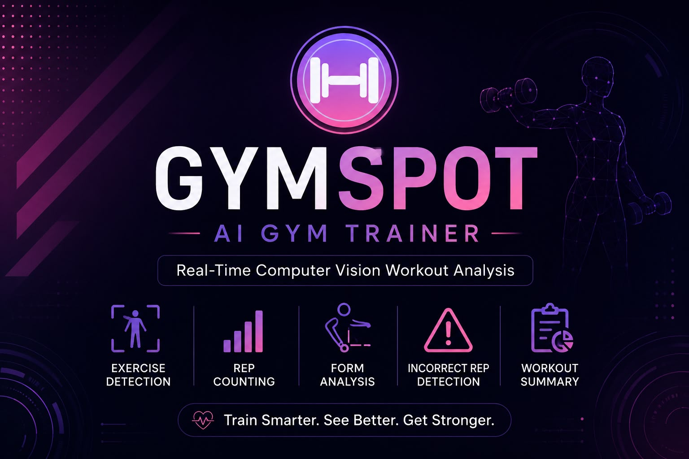

# AI Gym Trainer


A webcam-based app that watches a workout, automatically detects which
exercise is being performed, counts reps, checks form, and generates a
report at the end of the session.

## Features

- Real-time pose tracking via webcam (no special hardware needed)
- Automatic exercise detection (bicep curl, shoulder press, lateral raise)
- Live rep counting with correct/incorrect form feedback
- End-of-session workout report (JSON summary)
- Console mode (`main.py`) and GUI mode (`app.py`)

## Technologies

- Python
- MediaPipe (pose estimation)
- OpenCV (webcam capture)
- Tkinter (GUI)
- scikit-learn (exercise classifier)

## How it works (high level)

```
Webcam → MediaPipe Pose → Joint Angles → Exercise Classifier → Active Exercise
                                                                       │
                                              Rep Counting + Form Check
                                                                       │
                                                          Workout Report
```

## Project structure

```
ai_gym_trainer/
├── core/
│   ├── pose_estimator.py    # Wraps MediaPipe: camera frame -> landmarks
│   ├── angles.py             # calculate_angle() and landmark helpers
│   ├── exercise_base.py      # Shared template every exercise follows
│   ├── classifier.py         # Feature extraction + exercise auto-detection
│   └── report.py             # Builds the end-of-workout summary
├── exercises/
│   ├── bicep_curl.py
│   ├── shoulder_press.py
│   ├── lateral_raise.py
│   └── __init__.py           # EXERCISES registry (label -> class)
├── data/
│   ├── raw/                  # CSVs saved by collect_data.py (not tracked in git)
│   └── processed/            # Cleaned/merged datasets (not tracked in git)
├── models/                   # Trained classifier saved here (.pkl, not tracked in git)
├── assets/                   # Icons, logos, and diagrams used by the app
├── collect_data.py           # Records labeled training data from your webcam
├── train_model.py            # Trains the exercise classifier
├── test_exercise.py          # Standalone test for a single exercise module
├── main.py                   # Console workout loop (no GUI)
├── app.py                    # Tkinter GUI version
└── requirements.txt
```

> **Note:** `data/`, `models/*.pkl`, and the virtual environment are excluded
> from this repository via `.gitignore` to keep it lightweight. See
> [Data & Model Files](#data--model-files) below for how to get them.

## Getting Started (Step by Step)

### 1. Clone the repository

```bash
git clone https://github.com/Nourhasann/AI-Gym-Trainer.git
cd AI-Gym-Trainer
```

### 2. Create a virtual environment (recommended)

```bash
python -m venv .venv
```
Activate it:
- **Windows:** `.venv\Scripts\activate`
- **Mac/Linux:** `source .venv/bin/activate`

### 3. Install dependencies

```bash
pip install -r requirements.txt
```

### 4. Run the app

**Console mode** — quickest way to try it out:
```bash
python main.py
```
A window opens showing your webcam feed with a live rep counter,
correct/incorrect count, and feedback text. Do some real curls, then some
intentionally sloppy ones (swing your elbow out) to see the form-check
kick in. Press **q** with the window focused to quit — it saves
`workout_report.json` in the project folder.

**GUI mode** — a friendlier interface:
```bash
python app.py
```
Opens a Tkinter window with Start Workout / Finish Workout buttons, a live
camera feed, and a report panel shown after you finish. Run this from a
terminal, not from inside Jupyter — Tkinter's event loop doesn't play well
with notebooks.

## Building auto-detection (optional, once the basics are confirmed working)

By default the app can run in single-exercise mode. To enable automatic
detection between exercises:

1. **Collect labeled data** — run once per label, doing that exercise (or
   standing idle) in front of the camera:
   ```bash
   python collect_data.py --label bicep_curl
   python collect_data.py --label shoulder_press
   python collect_data.py --label lateral_raise
   python collect_data.py --label idle
   ```
   Press `r` to start/stop recording samples, `q` to save and quit.

2. **Train the classifier:**
   ```bash
   python train_model.py
   ```
   This saves `models/exercise_classifier.pkl`.

3. **Switch `main.py` to auto-detect mode** — edit the last line of
   `main.py`:
   ```python
   if __name__ == "__main__":
       run_workout()
   ```

4. Run `python main.py` again — it will now guess the exercise instead of
   assuming a single one.

## Adding a new exercise

Use `exercises/bicep_curl.py` as the template for the next exercise:

1. Create a new file in `exercises/` (e.g. `push_up.py`) and implement
   `update()` following the pattern in `bicep_curl.py` — compute the
   relevant joint angle(s), run an up/down state machine on angle
   thresholds, and add a form check.
2. Register it in `exercises/__init__.py`'s `EXERCISES` dictionary.
3. Collect labeled data for it: `python collect_data.py --label push_up`
4. Retrain: `python train_model.py`
5. Test it standalone first:
   ```python
   run_workout(use_classifier=False, forced_exercise="push_up")
   ```
   or run `test_exercise.py` against it.

## Data & Model Files

The raw training data (`data/raw/`) and trained classifier
(`models/exercise_classifier.pkl`) aren't included in this repository to
keep it lightweight and avoid committing large binary files to git.

You have two options for auto-detection:

**Option 1 — Use the provided data/model**
Download the pre-trained classifier and/or the labeled dataset here:
*([Click here to download](https://drive.google.com/drive/folders/1Zt0cAKrxMaUIyZQAQ908XTuHSeFlcZSn?usp=drive_link))*
Drop `exercise_classifier.pkl` into `models/`, or the CSVs into
`data/raw/`, and you're ready to go.

**Option 2 — Train your own**
Follow the [Building auto-detection](#building-auto-detection-optional-once-the-basics-are-confirmed-working)
steps below to record your own data and train a fresh model. This is
useful if you want the classifier tuned to your own body/camera setup.

> Note: you don't need either of these just to run the app in single-
> exercise mode — `main.py` works fine without a trained classifier.

## Screenshots / Demo

*(Add a screenshot or short GIF of the app in action here — this is one
of the first things visitors look for.)*
